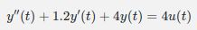

# Physics-Informaed Nerual Network for Fitting the Second order transfer function

- author: CHEN CHEN

## Content

This project intends to use PINN, the physics-informed nerual network to solve the following problems:

1. Fitting the transfer funciton in control theory using neural network technique.
2. Realize better performance for high-ferquency domain compared to previous LSTM, multi-step LSTM method when only this network can only be trained with low-frequency data.

## Start

This project is python based.
First, I recommend to use anconda to create visual environmen to mange all the required python packages.
Second,

## Theory

In this project, the main reason for using PINN is due to the limited frequecy domain of input data.
To get a good performance in wider frequency domain in bode plot, there are several ways to approach this goal. First, try to modify the parameters of network setting and so on to improve its robustness, which is definetely a classic research topic in ML/AI area.
However, the effort could large. Compared to directly fit the transfer function, I think a more feasible way to realize our goal is to fit the differenate equation, where the transfer function comes from.
For example, the first transfer equation could be changed into the following form:

## Env
system requirement: python version >= 3.10
```
s
```